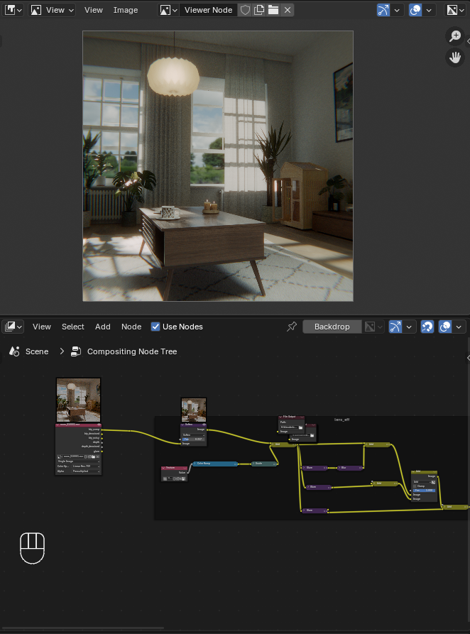

# Quickviewer for Blender


A **Blender Compositor add-on inspired by the workflow of Foundry Nuke**.

This tool allows artists to **assign compositor nodes to number keys (1–9)** and quickly send them to the **Viewer node**, replicating the fast node-inspection workflow common in Nuke.

The goal is to **speed up look-dev and compositing iteration** inside Blender.

---

# Demo

<!-- Replace with your GIF -->
[](docs/how_it_works_V01.mp4)

---

# Features

- Assign nodes to **viewer slots (1–9)**
- **Shift + number** → store active node
- **Number key** → send stored node to Viewer
- Automatically **creates a Viewer node if one does not exist**
- Designed for **fast compositing inspection**

---

# How It Works

1. Select any node in the **Compositor**.
2. Press:

```
Shift + 1–9
```

to **store the node in a slot**.

3. Press:

```
1–9
```

to **connect the stored node to the Viewer**.

This mimics the familiar **Nuke node preview workflow**.

---

# Installation

1. Download the `.py` file
2. Open **Blender → Edit → Preferences → Add-ons**
3. Click **Install**
4. Select the script
5. Enable the add-on

The hotkeys will automatically activate in the **Node Editor**.

---

# Requirements

- Blender **4.x or higher**
- Compositor enabled

---

# Current Version

**Version 1.0**

This is the **first version** of the tool and focuses on providing a minimal and fast workflow for viewer switching.

The tool will likely evolve as the workflow is tested in production or daily compositing use.

---

# Possible Improvements / Roadmap

Some ideas for future updates:

- Persistent slots saved in the `.blend`
- UI panel showing stored nodes
- Support for **multiple outputs**
- Slot clearing or slot management
- Optional **auto-viewer switching**
- Visual indicator of assigned slots
- Support for **auto-detecting node outputs**
- Better error handling for nodes without outputs
- Preferences panel for **custom hotkeys**

---

# Why This Tool Exists

Artists coming from **Nuke** often miss the ability to quickly inspect nodes using number keys.

This add-on recreates a similar **rapid preview workflow inside Blender**, reducing friction when working with complex compositor graphs.

---

# Author

**Edgar Aguirre**

VFX artist with experience in lighting, compositing workflows, and pipeline tools for production environments.

---

# License

MIT License (or your preferred license)
